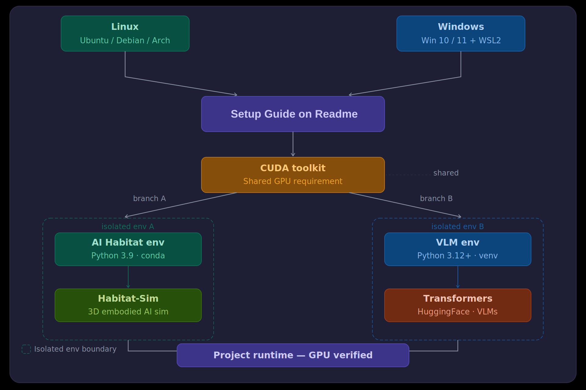
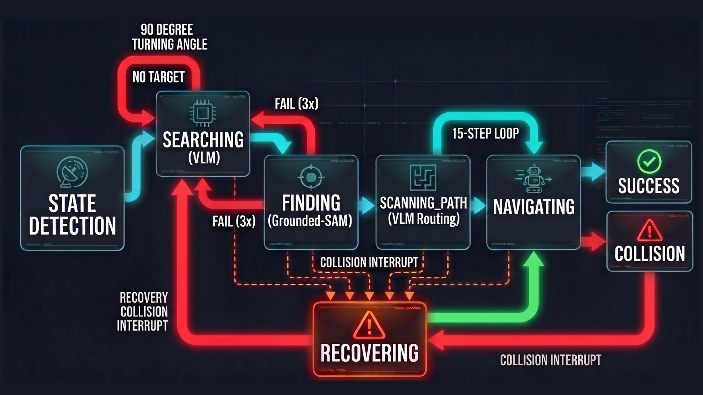

# OptiSight CoT Autonomous Navigating System


**📖 Read the Paper:**  
You can find the detailed methodology, architectural discussions, and experimental results in our official publication:  
[](https://arxiv.org/abs/2608.23354)

**Team:**

| Role | Name | Profile |
| :--- | :--- | :---: |
| Senior Scientist | Jordi Sanchez Riera | <a href="https://www.iri.upc.edu/staff/jsanchez"></a> |
| GenAI Research Intern | Alperen Avan | <a href="https://www.linkedin.com/in/alperenavan/"></a> |
| Institution | [IRI (Institut de Robòtica i Informàtica Industrial)](https://www.iri.upc.edu/) | <a href="https://www.iri.upc.edu/"></a> |


## Overview
OptiSight is an advanced Vision-Language and AI Habitat Dashboard designed with a primary goal: **Autonomous Spatial Navigation** and **Scene Understanding** using cutting-edge AI. 

At its core, OptiSight operates as a **CoT (Chain-of-Thought) System**. By utilizing a Chain-of-Thought reasoning loop, Vision-Language Models (VLMs), and Vision Foundation Models (Segmentation & Detection), the system acts as an autonomous agent that can perceive its 3D environment, make logical decisions, and navigate towards user-defined goals without human intervention. 

In addition to the autonomous agent, this project provides a comprehensive **Dashboard**. The dashboard allows developers and users to interact with, test, and inspect various components (such as standalone vision models or manual AI Habitat simulation) and deeply examine the reasoning logic of the system in real-time. The project runs seamlessly on both **Windows and Linux**.

> [!WARNING]  
> **GPU Requirement:** To run the Vision Language Models (VLM) and Vision Foundation Models (Segmentation/Detection), you **MUST** have a dedicated CUDA-compatible NVIDIA GPU. Trying to run this project on a CPU will result in extremely slow performance or failure.

---

## Project Structure
The repository is organized to maintain strict modularity between the frontend dashboard, backend API, and AI models. **Note on GitHub Tracking:** The \habitats/\ and \models/\ directories (and their subdirectories like \Vision Foundation/\, \Vision Language/\, \Segmentation/\) are tracked on GitHub via \.gitkeep\ files so the structure remains intact when you clone the project. However, the heavy 3D maps and AI model weights are completely ignored and will not be uploaded.

```text
├── codes/          # Core Python scripts for backend (server.py) and verification
├── docs/           # Architecture diagrams, charts, and GIFs for documentation
├── habitats/       # Designated folder for 3D Habitat simulation maps (.glb, .json, .tar)
├── models/         # Heavy local weights for Segmentation, Detection, and VLM models
├── setup/          # Terminal-based setup guides for Windows and Linux environments
├── static/         # CSS, JS, and asset files for the frontend web dashboard
├── templates/      # HTML templates for the frontend web dashboard
└── start.py        # Main entry point to check resources and launch OptiSight server
```

---

## System Architecture

The overall system architecture of OptiSight integrates large language models, vision foundations, and a simulated 3D habitat environment to achieve autonomous navigation and scene understanding.



## System Workflow & Pipeline

The system processes input dynamically, reasoning about its environment step-by-step. The following diagrams illustrate the operational flow from start to finish:

### 1. Conceptual Overview

This provides a high-level conceptual view of how the OptiSight agent interprets user goals and translates them into actionable insights within the environment.

### 2. Flowchart

The decision-making flowchart demonstrates the specific conditions and loops the agent evaluates to determine the next optimal action.

### 3. Logical Flow

The logical flow maps out the sequence of API calls, model inferences, and internal state updates that drive the autonomous navigation.

### 4. Operational Pipeline

The operational pipeline highlights the end-to-end data processing, from visual input capture to final motor command execution in the AI Habitat simulator.

---

## 1. Map Downloads (AI Habitat)
If you want to use the AI Habitat Simulation feature, you need 3D maps. We recommend the Matterport3D (HM3D) example dataset.

1. Download the pre-configured Habitat map tar archive: [hm3d-example-habitat-v0.2.tar](https://github.com/matterport/habitat-matterport-3dresearch/blob/main/example/hm3d-example-habitat-v0.2.tar)
2. Place the downloaded \.tar\ file exactly into the \habitats/\ directory in this project.
3. *Note: When you run \start.py\, the system will automatically extract the tar file, arrange the maps, and delete the archive to save space.*

---

## 2. Model Downloads
This project integrates three types of AI models. You must download the following default models into their respective folders inside the \models/\ directory:

1. **Segmentation Model:**  
   Download \sam2.1-hiera-tiny\ into \models/Segmentation/sam2.1-hiera-tiny/\.
2. **Vision Foundation Model:**  
   Download \GroundingDINO-main\ into \models/Vision Foundation/GroundingDINO-main/\.
3. **Vision Language Model:**  
   Download \Qwen3.5-VL-0.8B\ into \models/Vision Language/Qwen3.5-VL-0.8B/\.

*(Note: The system checks for these at startup and will warn you if they are missing.)*

---

## 3. Setup Instructions
We provide straightforward terminal-based setup guides for both Operating Systems. No complex `.bat` files are needed.

> [!TIP]
> **OS Recommendation:** While the project supports both operating systems, **Linux is highly recommended**. Running this project on Windows requires WSL2 and Conda, which will consume a massive amount of disk space due to the underlying Linux virtual machine and heavy ML dependencies.

- **For Windows Users:** Please refer to the [Windows Setup Guide](setup/windows.md)
- **For Linux Users:** Please refer to the [Linux Setup Guide](setup/linux.md)

---

## 4. Running the Dashboard
Once the setup steps are completed and models/maps are placed:

```bash
python start.py
```
This will automatically verify your resources, extract maps if necessary, and start the local server. Navigate to `http://localhost:8000` in your web browser.

### Using the Interface Modes
Upon launching the dashboard, you will have several modes available:

- **Photo / Video Modes:** These are purely for **model testing**. They allow you to upload static images or videos to independently test the VLM and segmentation models without running the 3D simulator.
- **AI Habitat Sim - Live Control:** This is also a **testing environment**. It allows you to manually navigate the 3D map using your keyboard (W, A, S, D) to verify the simulator is working.
- **OptiSight CoT (Full Screen):** 🌟 **(Recommended)** This is the main autonomous navigation mode. It runs the full Chain-of-Thought pipeline in an immersive full-screen interface.
- **OptiSight CoT (Windowed):** An alternative view of the main autonomous mode, scaled down into a windowed UI.
- **Configure Settings:** In the autonomous modes, you can open the *Configure Settings* panel. Here, you can inspect the internal working principles, prompt structures, and reasoning logic of the system in real-time.

---

## 5. Experiments & Demonstrations

Our system has been rigorously tested across various complex scenarios to evaluate the autonomous navigation, visual grounding, and language reasoning capabilities.

> [!NOTE]
> **Evaluation & Success Rates (Table I):** 
> Please note that there is no automated evaluation pipeline or script in this repository to compute the final success rates. The `experiments/result_NN.txt` files log the exact starting point and final result for the *single* trial recorded in its corresponding demonstration video. We have 24 distinct experiments/scenarios in total. To determine the aggregated success rates reported in the paper (Table I), each of these 24 scenarios was tested **10 times manually**. Those 10 repetitions per experiment were conducted, evaluated, and tallied entirely by hand to calculate the final numbers.


**📖 Read the Paper:**  
Detailed methodology, results, and architectural discussions are available in our official publication:  
[**OptiSight CoT Autonomous Navigating System** (arXiv:2608.23354)](https://arxiv.org/abs/2608.23354)

You can view our complete set of experiment and demonstration videos here:  
[Google Drive - OptiSight Experiment Videos](https://drive.google.com/drive/folders/1BUqd38gp1u8Yjrdyx4i71gEhp_5i-Gde)
